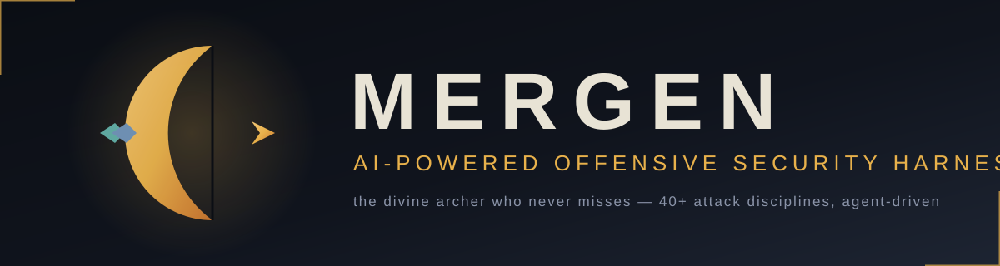
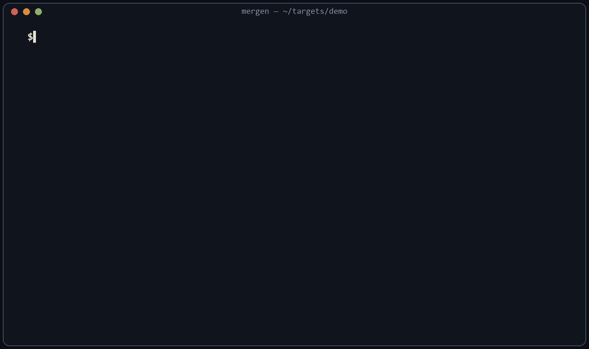

<p align="center">
  
</p>

<p align="center">
  <b>Named after Mergen, the divine archer of Turkic mythology — the one who never misses.</b><br/>
  AI-powered offensive security harness: an agentic TUI that arrives with a battle-tested
  attack knowledge base and the discipline to use it on authorized targets.
</p>

<p align="center">
  <a href="LICENSE"></a>
  
  
  
</p>

---

## What is Mergen?

Mergen is an **agentic offensive-security harness**: an AI operator (TUI + web) that
reads targets, plans attack chains, and executes authorized pentest workflows —
guided by a large curated knowledge base of real techniques.

<p align="center"></p>

*MCP Guard in action: Mergen connects to a configured MCP server, and before the agent sees any tool, the guard flags a poisoned `read_notes` description trying to exfiltrate `~/.ssh/id_rsa`.*

- **40+ attack disciplines** as structured skills: SSRF, SSTI, XXE, request
  smuggling, race conditions, subdomain takeover, JWT, GraphQL, prototype
  pollution, CORS, host-header, IDOR automation, WebSocket, cache poisoning,
  rate-limit bypass — plus **MCP/LLM security** (`.mergen/skill/mcp-security`).
- **Full-spectrum knowledge base** (~7,700 files): MITRE ATT&CK (Enterprise,
  ICS, Mobile), OWASP WSTG, CIS benchmarks, cloud post-exploitation
  (AWS/Azure/GCP), K8s, AD/Kerberos, Linux/Windows/macOS post-exploitation.
- **Methodology + memory**: engagement workflows, per-target memory, and
  chain-of-attack reasoning instead of one-shot payloads.
- **MCP Guard** *(unique)*: Mergen audits every configured MCP server's tool metadata
  for poisoning, hidden instructions, and command-injection surface **before** the
  agent is allowed to use it — the same detection engine as
  [mcp-sentinel](https://github.com/TiaMEOWS/mcp-sentinel), embedded in the harness.
  Disable with `MERGEN_DISABLE_MCP_GUARD=1`.
- **HackBrowser**: capture and replay real browser traffic during engagements.
- **Brand-new look**: the "Steppe Night" theme — deep charcoal blues with the
  golden-amber of Mergen's bow.

## Why Mergen?

| | Mergen | CyberStrike (upstream) | PentestGPT-style wrappers |
|---|---|---|---|
| MCP supply-chain audit (MCP Guard) | ✅ blocks poisoned tools before the agent sees them | — | — |
| Rug-pull detection (baseline diff) | ✅ | — | — |
| Hosted gateway / paywall | none — BYOK only | Zen credits | varies |
| Phones home | never — local-first | proxied to hosted domain | varies |
| Attack skill library | 40+ disciplines, 7.6K files | same (inherited) | prompt snippets |
| Engagement reporting | full report + H1/Intigriti submission drafts | full report | — |
| `mcp audit` CI command | ✅ exit-code gated | — | — |

## Platform support

CI-tested on Linux. Windows runs fine for real usage; parts of the upstream
test suite still assume POSIX path semantics (known limitation — help welcome).

## Quick start

Requires [Bun](https://bun.sh) 1.3+.

```bash
git clone https://github.com/TiaMEOWS/mergen.git
cd mergen
bun install
bun run dev        # TUI
bun run dev:web    # web app
```

## Responsible use

Mergen is built for **authorized** security work: your own systems, signed
pentest engagements, in-scope bug bounty programs, and training labs. It is not
a toy and not a weapon — you are responsible for staying in scope and in law.

## Lineage & license

Mergen is a fork of [CyberStrike](https://github.com/CyberStrikeus/CyberStrike)
(AGPL-3.0), which builds on the open-source [opencode](https://opencode.ai)
harness. Mergen's changes: complete rebrand, new default theme, the
`mcp-security` skill, and curated additions going forward.

Licensed under **AGPL-3.0** — see [LICENSE](LICENSE). Original copyright notices
are preserved as required.